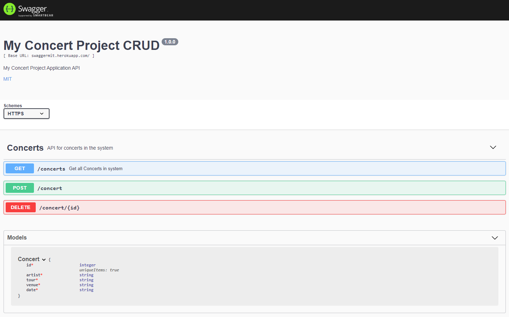

# Swagger
 
 Test API and Documentation using Swagger

## Description 
This is an example of creating CRUD APIs and using Swagger for Documentation 

## Purpose 
This was done as an assignment in the MIT course - Full Stack Development with Mern

---------

## Technologies Used 
- HTML
- CSS
- Javascript

---------

## Installation 
- Clone this repository to your local machine
- Open a command line on your computer and run the command cd path-to-project-root (this should be the actual directory where the repository is located on your local machine)
- Within the same command-line window, run npm start
- Open your browser of choice and browse to http://localhost:3000/api-docs

## How to Run 
- When the page is loaded in your browser, you will notice various api documentation

---------

## Files 
  - **app.js** - APIs and HTTP Server
  - **/swagger.json** - Swagger documentation file for APIs

---------

## Contributing 
Pull requests are welcome. For major changes, please open an issue first to discuss what you would like to change.

## License
[The MIT License (MIT)](https://github.com/slumpbuster/Swagger/blob/main/LICENSE)

